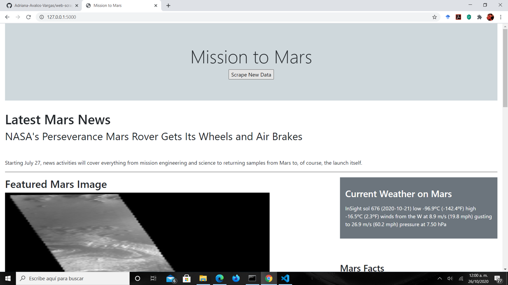

# web-scraping-challenge
- - - - - 
# Web scraping homework- Mision to Mars

# Contents of the repository

In this repository there is a folder named  Mission_mars, which content is described in the next list:

* Python file: scrape_mars.py

This file contains the scraping functions and the mongo connection to create the data base. It is important to note that to run the web page it is necessary to use **Chrome driver** for the JPL and Mars Hemispheres pages, while to scrape Mars weather from Twitter it is necessary to use **Gecko Driver**. 

* Python file: app.py

This files contains the flask application that conects to the mongo db data base and to the scrape_mars.py file.

* Jupyter Notebook: mission_to_mars.ipynb

This file also containd the scraping program. Therefore, in order to run it the **Chrome Driver** and **Gecko Driver** are necessary.

* Folder templates

It contain an html file called index that renders a web page with Mars info obtained from the scraping function.

* Folder notebooks

It contains five different jupyter notebooks. Each notebook contains the code to do the web scraping  suggested in each web page from Part 1 of the challenge.

* PDF document: Mission to Mars

It is PDF printing of the web page result.

The result is a web page that is shown in the next figure.

